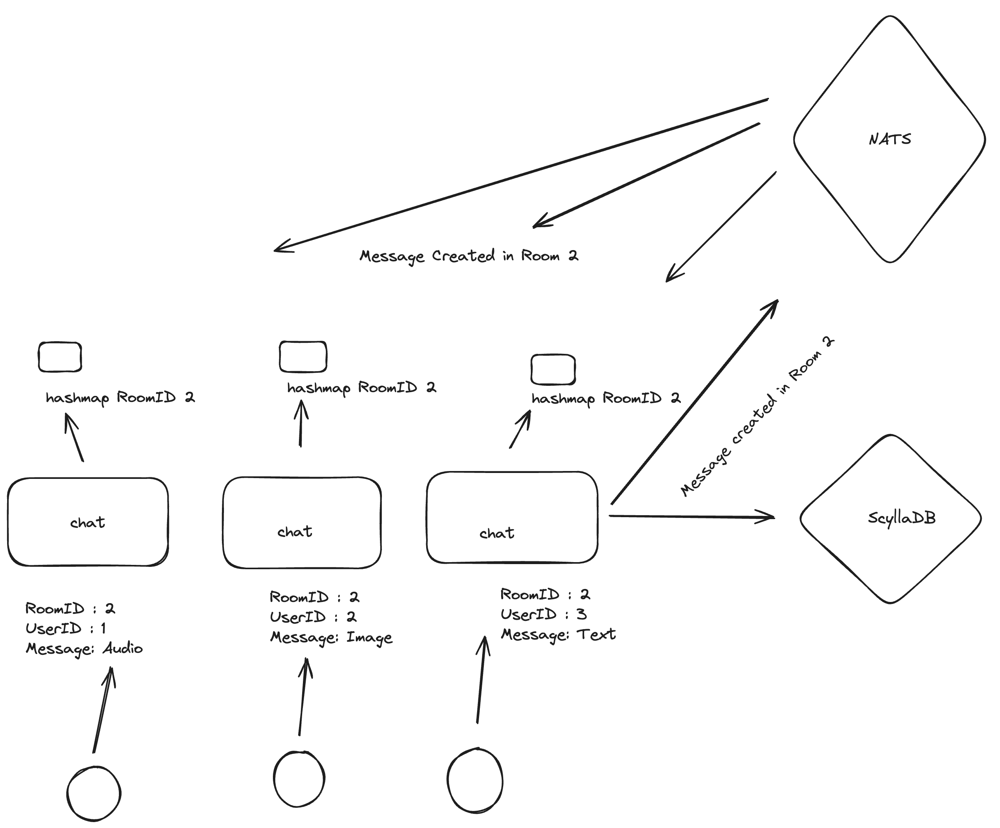

# chat
Distributed chat application using Websocket, ScyllaDB and NATS.
It is lightweigth and horizontally scalable.

**Rough, ~but beautiful~ high-level overview:**

## Running
`make scylla` to spin up a single-node ScyllaDB instance.

`make nats` to spin up NATS.

`make migrate` to apply the migration files found in `internal/db/cql`.

`make server` to start serving requests.

`make client` to connect to the websocket server.

### Cleanup

`make scylla-rm` & `make nats-rm`.

## Testing
Run tests with `make test` or with `go test ./...`. Tests that need a database connection will be excluded from these commands.
To run the database tests, run `make test-db`. 

## Migrations
The `cmd/migrate` tool provides a helper for CQL migrations, creating the necessary keyspaces as defined in the `config.yaml` file and executing migration files found in the `db/cql` directory.

Applied migrations will be logged to stdout. Do *not* edit applied migration files; instead, create new files for any edits. Migration files that have been successfully applied will be skipped in future migration runs.

To apply the migration, run either `make migrate` or `go run cmd/migration/main.go`.

## Client
`cmd/client` tool provides a helper chat client for quickly joining and troubleshooting a websocket connection.
`make client` will connect to a default chat room. Run `go run cmd/client/main.go --roomID=<uuid>` to connect to a custom room.

## TODO
# Handling reconnection.
# End-to-end encryption.
# Support for Audio & Video.
